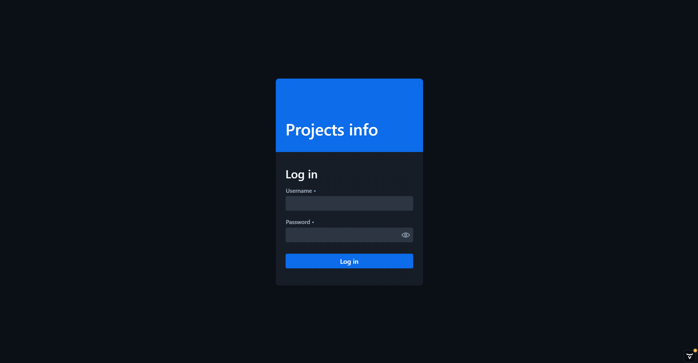

# Projects Info

## О проекте

<strong>Projects Info</strong> — это современное веб-приложение для управления проектами. 
Приложение предоставляет удобный и интуитивно понятный пользовательский интерфейс, для сотрудников компании по разработке ПО.

Проект создан с использованием современных технологий, включая <strong>Java</strong>, <strong>Spring Boot</strong>, и <strong>Vaadin</strong>, что обеспечивает высокую производительность и простоту использования.

## Основные возможности приложения

### Поддержка ролей с различными уровнями доступа

#### Admin
<ul>
    <li>Просмотр всех сотрудников</li>
    <li>Просмотр всех сотрудников (с возможностью редактирования)</li>
    <li>Добавление сотрудника</li>
    <li>Просмотр всех проектов (с возможностью редактирования)</li>
    <li>Добавление проекта</li>
    <li>Просмотр всех задач (с возможностью редактирования)</li>
    <li>Создание резервной копии БД</li>
    <li>Восстановление БД из резервной копии</li>
    <li>Генерация отчета по всем задачам</li>
</ul>

#### Project Manager
<ul>
    <li>Просмотр всех сотрудников</li>
    <li>Просмотр сотрудников (на текущих проектах сотрудника)</li>
    <li>Просмотр проектов (на текущих проектах сотрудника, с возможностью редактирования)</li>
    <li>Добавление проекта</li>
    <li>Просмотр задач (на текущих проектах сотрудника, с возможностью редактирования)</li>
    <li>Добавить задачу (к текущим проектам сотрудника)</li>
    <li>Просмотр багов (на текущих проектах сотрудника)</li>
    <li>Генерация отчета по всем задачам на текущих проектах сотрудника</li>
    <li>Генерация отчета по активным задачам на текущих проектах сотрудника</li>
    <li>Генерация отчета по завершенным задачам на текущих проектах сотрудника</li>
    <li>Генерация отчета по всем багам на текущих проектах сотрудника</li>
</ul>

#### Developer (Fullstack, Backend, Frontend)
<ul>
    <li>Просмотр проектов (на которых задействован сотрудник)</li>
    <li>Просмотр задач (своих задач, с возможностью изменения статуса задачи)</li>
    <li>Просмотр багов (на текущих проектах сотрудника, с возможностью изменения статуса бага)</li>
</ul>

#### Tester (QA, AQA)
<ul>
    <li>Просмотр проектов (на которых задействован сотрудник)</li>
    <li>Просмотр задач (своих задач, с возможностью изменения статуса задачи)</li>
    <li>Просмотр багов (на текущих проектах сотрудника, с возможностью редактирования)</li>
    <li>Добавление бага</li>
</ul>

#### User (DevOps, Data Scientist, Data Analyst)
<ul>
    <li>Просмотр проектов (на которых задействован сотрудник)</li>
    <li>Просмотр задач (своих задач, с возможностью изменения статуса задачи)</li>
</ul>

## Инструменты

<ul style="list-style-type: none; padding: 0;">
  <li>🚀 <strong>Java 17+</strong>: основной язык разработки.</li>
  <li>🌱 <strong>Spring Boot 3.x</strong>: создание веб-приложений и REST API.</li>
  <li>🎨 <strong>Vaadin 24.x</strong>: разработка пользовательского интерфейса.</li>
  <li>🔒 <strong>Spring Security</strong>: управление аутентификацией и авторизацией.</li>
  <li>💾 <strong>Hibernate/JPA</strong>: работа с базами данных через ORM.</li>
  <li>🛢️ <strong>PostgreSQL</strong>: реляционная база данных.</li>
  <li>📋 <strong>Liquibase</strong>: управление миграциями базы данных.</li>
  <li>🔧 <strong>Mapstruct</strong>: автоматический маппинг объектов.</li>
  <li>🛠️ <strong>Maven</strong>: система сборки и управления зависимостями.</li>
  <li>✂️ <strong>Lombok</strong>: упрощение написания кода.</li>
  <li>🧪 <strong>JUnit 5</strong>: написание и выполнение модульных тестов.</li>
</ul>

## Сборка и запуск

### Требования

<ul style="list-style-type: none; padding: 0; margin: 0;">
  <li>✔️ Установленный <strong>JDK 17</strong> или новее.</li>
  <li>✔️ Установленный <strong>Maven 3.6</strong> или новее.</li>
</ul>

---

### Шаги для запуска

<ol style="font-size: 1.1em; margin-left: 20px;">
  <li>
    <strong>Клонируйте репозиторий:</strong>
    <pre style="background-color: #f4f4f4; padding: 10px; border-radius: 5px; border: 1px solid #ddd;">git clone https://github.com/ArtemChernikov/projects-info.git</pre>
  </li>
  <li>
    <strong>Перейдите в папку с проектом:</strong>
    <pre style="background-color: #f4f4f4; padding: 10px; border-radius: 5px; border: 1px solid #ddd;">cd projects-info</pre>
  </li>
  <li>
    <strong>Выполните сборку проекта:</strong>
    <pre style="background-color: #f4f4f4; padding: 10px; border-radius: 5px; border: 1px solid #ddd;">mvn clean install</pre>
  </li>
  <li>
    <strong>Запустите приложение:</strong>
    <pre style="background-color: #f4f4f4; padding: 10px; border-radius: 5px; border: 1px solid #ddd;">mvn spring-boot:run</pre>
  </li>
  <li>
    <strong>Откройте приложение в браузере по адресу:</strong>
    <pre style="background-color: #f4f4f4; padding: 10px; border-radius: 5px; border: 1px solid #ddd;">http://localhost:8080</pre>
  </li>
</ol>

## Скриншоты интерфейса

---
